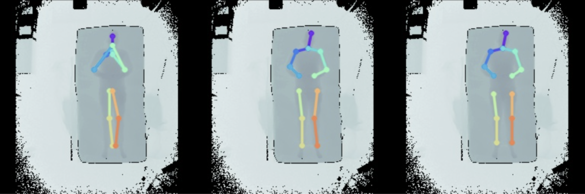
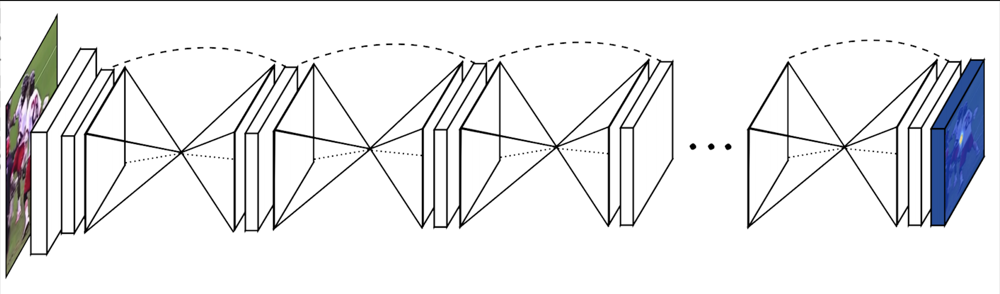

# Sleep Posture Analsis Using Deep Learning Approaches
The discipline of computer vision has made notable advancements in comprehending the semantic connotations associated with visual content. However, the algorithms employed by the system may encounter difficulties when faced with tasks that involve unfavorable visual conditions or when there is a scarcity of data or label pairs. The estimation of body pose while in a supine position presents a significant challenge within the domain of computer vision. This particular problem holds substantial importance in the context of medical research. Unfortunately, a conspicuous absence of publicly available datasets was observed in this particular domain in the past.
<figure>
  
  <div style="display:flex; align-items:center; justify-content: center;"><figcaption><b>Figure 1</b>: model's Output</figcaption></div>
</figure>
In recent times, a dataset known as the simultaneously collected multimodal Lying Pose (SLP) dataset has been introduced. The dataset referred to as SLP consists of images capturing the in-bed poses of 109 participants. These images were obtained using different imaging technologies, such as Red-Green-Blue (RGB), long-wave infrared (LWIR), depth, and pressure mat (PM) modalities. This dissertation aims to conduct a thorough examination of the simultaneously collected multimodal Lying Pose (SLP) dataset, offering a comprehensive discourse on its various elements[1].
In this investigation, the focus will be on the complex matter of body pose estimation, with an emphasis on a prominent deep-learning approach that has made notable advancements in the field of computer vision: the Stacked Hourglass Networks for Human Pose Estimation[2]. I intend to provide a comprehensive explanation of the fundamental operational principles of this model and subsequently proceed with the implementation of this established framework. After the implementation, the resulting outputs will undergo a thorough analysis to provide valuable insights into its effectiveness, performance metrics, and the various potential applications it has in real-world situations. In conclusion, this study will additionally provide a presentation of various innovative ideas and recommendations for future endeavors within this field.
<figure>
  
  <div style="display:flex; align-items:center; justify-content: center;"><figcaption><b>Figure 2</b>: Stacked Hourglass Network</figcaption></div>
</figure>

# 1. Requirements
This project is developed using Python version 3.8.13. It relies on the following third-party libraries:

```
-f https://data.pyg.org/whl/torch-2.0.1+cpu.html
tqdm
torch===2.0.1
torchvision
cv2
numpy
scipy
skimage
matplotlib
math
IPython
json
os
```

# 2. Project Structure
```
project
│───assets                      # Contains visual assets like network diagrams and figures
│───SLP                # Houses the raw data utilized during training
│───rstT      # # Contains samples of the processed data and associated heatmaps
│───plots                      #Directory for generated figures and plots
│───output                      # # Directory for storing experimental outputs and results
│   dataset.py                  # Script responsible for loading and preprocessing the raw dataset
│   main.ipynb            # Jupyter notebook containing the primary experimental workflow
│   Essential.py               # Script that encompasses various experimental ideas and approaches
│   README.md                   # Project Documentation.
│   metrics.py                     # Contains metric computation functions and methods
│   parameter.py                     # Script for managing and adjusting experimental parameters
│   plot.py                     # Contains functions for generating and displaying plots
│   StackedHourglass.py                     # Module implementing the Stacked Hourglass architecture
│   train.py                 # Functions dedicated to the training and validation processes
```

# 3. Instructions for Execution

## 3.1. Acquiring the Dataset

Details about the dataset, as well as the procedure for access requests, can be found on the [SLP page at the ACLab website](https://web.northeastern.edu/ostadabbas/2019/06/27/multimodal-in-bed-pose-estimation/).

## 3.2. Training the Model

To train the model:
1. Open the `main.ipynb` notebook.
2. Navigate to the **Run Training** section.
3. Multiple configurations are available for training. Choose the desired configuration and execute the respective cells.

## 3.3. Testing the Model

To test the model:
1. Open the `main.ipynb` notebook.
2. Navigate to the **Run Testing** section.
3. Various configurations are available for testing. Choose the desired configuration and execute the respective cells to test the model performance with different setups.

# 4. Results


## PCKh@0.5 Performance

| Modality | Dana Lab (c0) | Dana Lab (c1) | Dana Lab (c2) | Dana Lab (Total) | Dana Lab All Covers (c0) | Dana Lab All Covers (c1) | Dana Lab All Covers (c2) | Dana Lab All Covers (Total) |
|----------|---------------|---------------|---------------|------------------|--------------------------|--------------------------|--------------------------|-----------------------------|
| LWIR     | 94.9%         | 90.6%         | 89.9%         | 93.7%            | 58.1%                    | 85.7%                    | 86.5%                    | 93.7%                       |
| PM       | 89.2%         | 88.6%         | 89.9%         | 90.9%            | **89.0%**                | 88.6%                    | 90.1%                    | 90.9%                       |
| Depth    | **96.3%**     | **91.1%**     | **91.4%**     | **95.3%**        | 77.2%                    | **90.9%**                | **91.4%**                | **95.3%**                   |


## PCKh@0.5 Performance
| Joints        | IR   | Depth | PM   | IR + Depth | IR + PM | Depth + PM | IR + Depth + PM |
|---------------|------|-------|------|------------|---------|------------|-----------------|
| Right Ankle   | 95.0 | 92.2  | 94.6 | 95.1       | 96.2    | **98.8**   | 98.0            |
| R Knee        | 96.0 | 94.8  | 94.3 | 98.2       | 97.7    | **98.8**   | 98.3            |
| R Hip         | 85.7 | 91.9  | 92.5 | 84.5       | 84.9    | **94.0**   | 88.8            |
| L Hip         | 87.1 | 92.6  | 90.9 | 84.7       | 85.4    | **95.6**   | 90.4            |
| L Knee        | 95.5 | 91.4  | 94.8 | 98.1       | 97.3    | 98.3       | **98.5**        |
| L Ankle       | 94.9 | 88.5  | 96.0 | 96.5       | 97.5    | **98.5**   | 98.0            |
| R Wrist       | 90.2 | 78.0  | 76.5 | 93.8       | 92.8    | 93.4       | **96.0**        |
| R Elbow       | 92.8 | 87.5  | 84.5 | 96.7       | 94.8    | **97.6**   | 97.3            |
| R Shoulder    | 92.3 | 96.0  | 91.0 | 90.5       | 93.5    | **96.5**   | 93.3            |
| L Shoulder    | 94.6 | 96.1  | 90.7 | 93.6       | 96.1    | **98.2**   | 94.4            |
| L Elbow       | 93.5 | 85.6  | 85.2 | 96.2       | 95.1    | 97.1       | **97.6**        |
| L Wrist       | 88.2 | 76.3  | 77.2 | 94.1       | 93.3    | 94.6       | **95.9**        |
| Thorax        | 98.8 | 99.3  | 98.1 | 98.7       | 99.1    | **99.1**   | 99.0            |
| Head          | 98.1 | 97.0  | 92.0 | 98.1       | 98.6    | **98.6**   | 98.5            |
| Total         | 93.0 | 90.5  | 89.9 | 94.2       | 94.5    | **97.1**   | 96.0            |


# 5. References
[1] S. Liu, X. Huang, N. Fu, C. Li, Z. Su, and S. Ostadabbas, "Simultaneously-Collected Multimodal Lying Pose Dataset: Enabling In-Bed Human Pose Monitoring," IEEE Transactions on Pattern Analysis & Machine Intelligence, vol. 45, no. 01, pp. 1106-1118, Jan. 2023, issn: 1939-3539. doi: 10.1109/TPAMI.2022.3155712. [Online].

[2] A. Newell, K. Yang, and J. Deng, "Stacked Hourglass Networks for Human Pose Estimation," European Conference on Computer Vision, 2016. [Online]. Available: https://api.semanticscholar.org/CorpusID:13613792.

